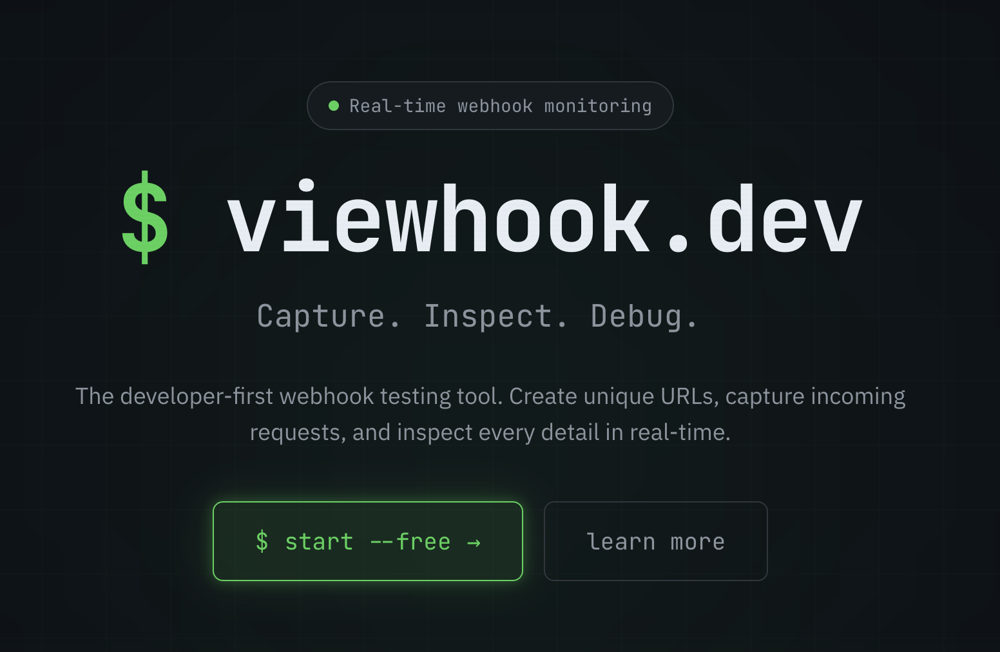

# Viewhook — Open-Source Webhook Tester

A free, self-hosted webhook testing tool. Inspect, debug, and forward HTTP requests in real time.

Similar to Webhook.site and RequestBin, but open-source and self-hostable with zero external dependencies.

[](https://github.com/paulund/viewhook/actions/workflows/ci.yml)
[](LICENSE)
[](https://php.net)
[](https://laravel.com)



## Features

- 🔗 **Webhook URL management** — create unique endpoints with UUIDs or custom slugs
- 📨 **Capture all HTTP methods** — POST, GET, PUT, PATCH, DELETE, and more
- 👀 **Real-time updates** — see requests as they arrive via WebSockets (Laravel Reverb)
- 🔍 **Request inspection** — view headers, body, query params, and metadata
- 🔀 **Webhook forwarding** — forward captured requests to any target URL
- 🔔 **Slack notifications** — get notified in Slack for every captured request
- 📧 **Email notifications** — receive email alerts for captured requests
- 📤 **Export** — download requests as CSV or JSON
- 🏷️ **Custom slugs** — give your endpoint a memorable name
- ⚡ **Rate limiting** — configurable per-URL hourly limits
- 🗑️ **Data retention** — automatic cleanup of old requests
- 🔐 **Authentication** — email/password registration and login
- 🗄️ **SQLite by default** — zero external database dependency

## Quick Start (Docker)

```bash
# Generate an app key
docker run --rm php:8.4-cli php -r "echo 'base64:'.base64_encode(random_bytes(32)).PHP_EOL;"

# Pull and run the image
docker run -d \
  --name viewhook \
  -p 8080:8080 \
  -v viewhook-data:/data \
  -e APP_KEY=<your-key> \
  -e APP_URL=http://localhost:8080 \
  ghcr.io/paulund/viewhook:latest
```

Visit http://localhost:8080

## Quick Start (Development)

```bash
# Clone the repository
git clone https://github.com/paulund/viewhook.git
cd viewhook

# Copy environment file
cp .env.example .env

# Start with Laravel Sail (Docker)
./vendor/bin/sail up -d

# Install dependencies
./vendor/bin/sail composer install
npm install

# Generate app key and run migrations
./vendor/bin/sail artisan key:generate
./vendor/bin/sail artisan migrate

# Start the dev server
npm run dev
```

Visit http://localhost

## Configuration

All limits are configurable via environment variables:

| Variable                   | Default   | Description                                            |
| -------------------------- | --------- | ------------------------------------------------------ |
| `VIEWHOOK_RATE_LIMIT`      | `100`     | Maximum requests per URL per hour                      |
| `VIEWHOOK_RETENTION_HOURS` | _(empty)_ | Hours to keep captured requests (empty = keep forever) |
| `VIEWHOOK_MAX_PAYLOAD_KB`  | `10240`   | Maximum payload size in KB (10 MB)                     |

See `.env.example` for the full list of available environment variables.

## Deploy

### Railway

[](https://railway.app/new/template)

### Coolify

Add the image `ghcr.io/paulund/viewhook:latest`, set the required environment variables, attach a persistent volume at `/data`, and deploy.

### DigitalOcean App Platform

[](https://cloud.digitalocean.com/apps/new)

Use the Docker image `ghcr.io/paulund/viewhook:latest`. Attach a persistent volume at `/data` for the SQLite database.

### Self-hosted (Docker)

```bash
docker run -d \
  --name viewhook \
  --restart unless-stopped \
  -p 8080:8080 \
  -v viewhook-data:/data \
  -e APP_KEY=<your-key> \
  -e APP_URL=https://your-domain.com \
  ghcr.io/paulund/viewhook:latest
```

## Architecture

- **Backend:** Laravel 12 (PHP 8.4)
- **Frontend:** Inertia.js + React + TypeScript
- **Styling:** Tailwind CSS v4
- **Database:** SQLite (development and production self-hosting)
- **Cache/Queue:** Database-backed (no Redis required)
- **Real-time:** Laravel Reverb (WebSockets)
- **Auth:** Laravel Sanctum + Breeze

### Layer Structure

| Layer                                 | Responsibility                             |
| ------------------------------------- | ------------------------------------------ |
| **Actions** (`app/Actions/`)          | Single-purpose business logic entry points |
| **DTOs** (`app/DataTransferObjects/`) | Immutable data containers between layers   |
| **Services** (`app/Services/`)        | External I/O (no DB writes)                |
| **Jobs** (`app/Jobs/`)                | Async work, persist via model methods      |
| **Models** (`app/Models/`)            | Eloquent models with domain logic          |

See [docs/](docs/) for detailed architecture documentation.

## Running Tests

```bash
# All backend checks (lint + static analysis + tests with 100% coverage)
./vendor/bin/sail composer run test

# All frontend checks (eslint + prettier + typescript + vitest)
npm test
```

## Contributing

Contributions are welcome! Please read [CONTRIBUTING.md](CONTRIBUTING.md) for code style, testing requirements, and the PR process.

## Sponsors

If Viewhook saves you time, consider [sponsoring the project](https://github.com/sponsors/paulund). Your support helps keep it maintained and free for everyone.

## License

MIT — see [LICENSE](LICENSE).

---

Built by [Paul Underwood](https://paulund.co.uk).
